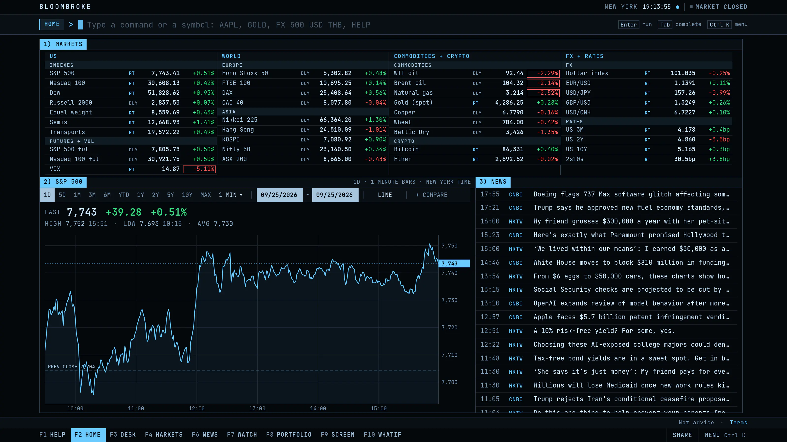
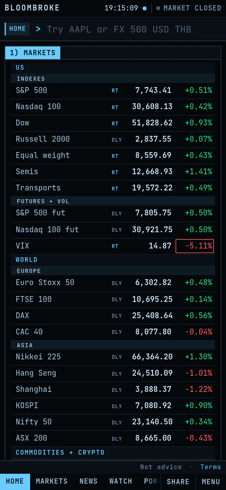
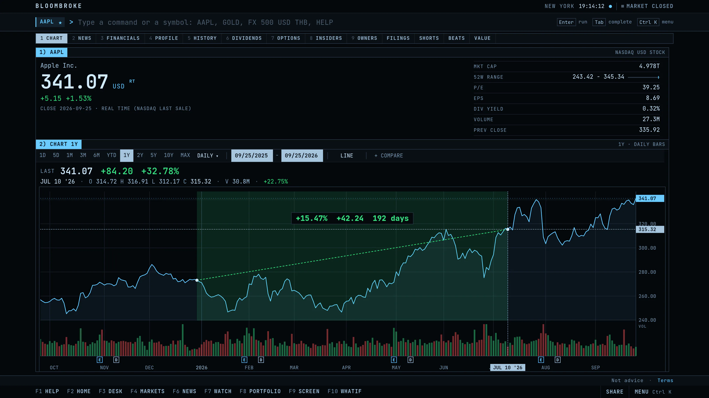
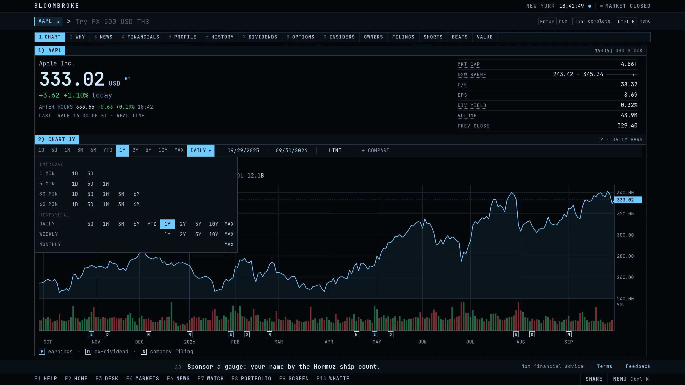
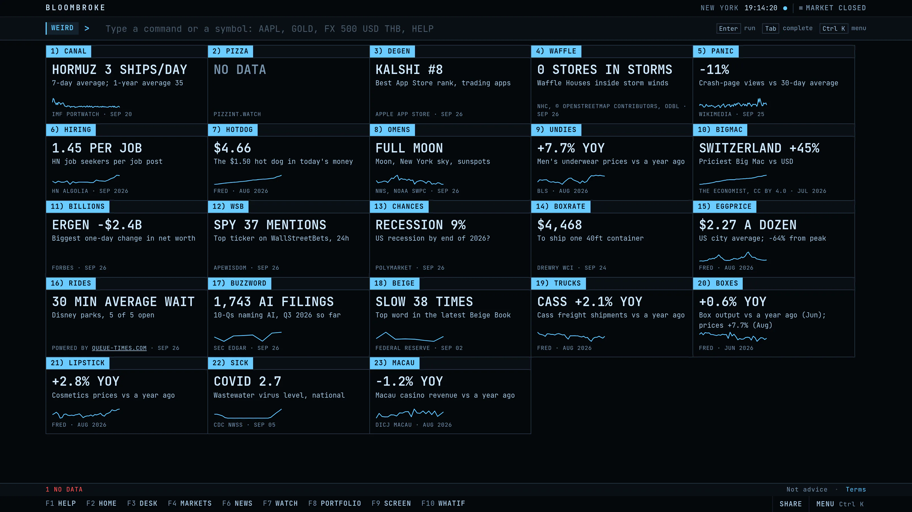
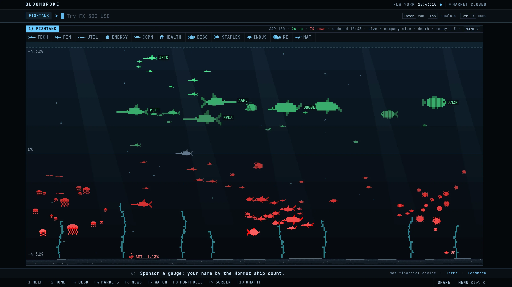
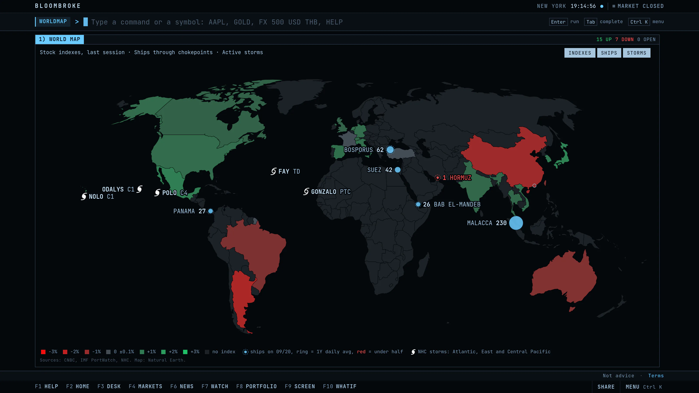
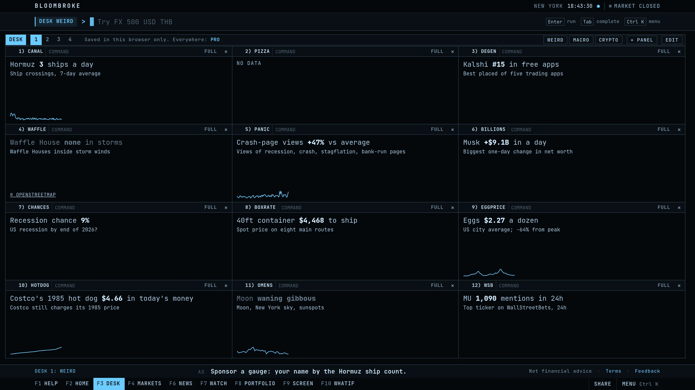
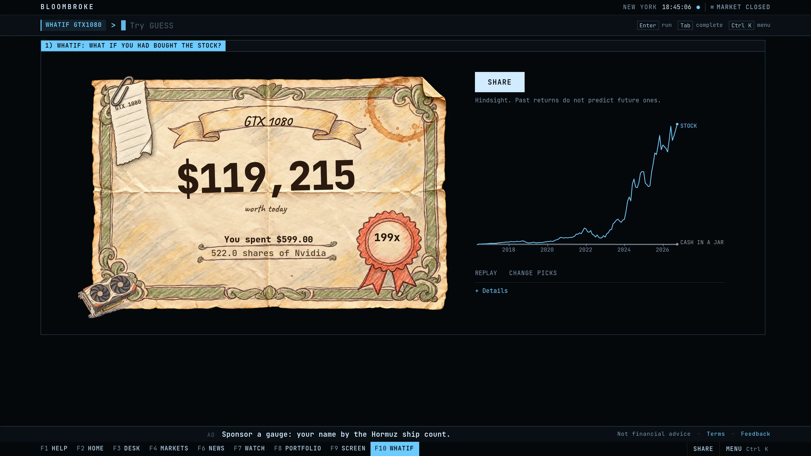
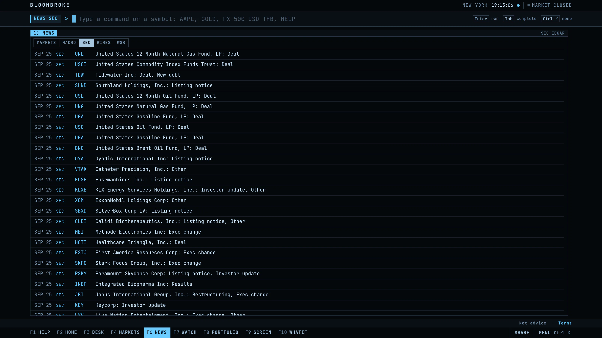

# Bloombroke

**The $32,000 terminal, now $4.20/mo.**

Keyboard-first market info: live quotes, charts, SEC financials, screener, options, watchlist, portfolio, 50+ plain-English commands. Type HELP.

Live at **[bloombroke.com](https://bloombroke.com)**. Free to use, no account.



## Try these

Open [bloombroke.com](https://bloombroke.com), type a command, press Enter. Every screen is a link: the command lives in the URL (`/?c=AAPL+1Y`).

| Command | What you get |
| --- | --- |
| `HOME` | Markets, the S&P 500 and news on one screen |
| `AAPL` | Any ticker: price, chart and key numbers |
| `AAPL 1Y WEEKLY` | A range and a bar period, typed |
| `MARKETS` | World indexes, futures, commodities, FX and rates |
| `NEWS SEC` | The latest 8-K filings from SEC EDGAR |
| `WEIRD` | 23 odd live gauges on one screen |
| `CANAL` | Ships through Hormuz, Suez, Panama and other chokepoints |
| `FISHTANK` | The S&P 100 as fish |
| `WORLDMAP` | Indexes, shipping chokepoints and active storms on a map |
| `DESK WEIRD` | Your own screen, loaded with twelve weird gauges |
| `WHATIF` | What the money would be worth in the maker's stock |
| `AFFORD` | Cost per use of a thing you buy, and a verdict |
| `ALERTS AAPL > 350` | A note when a price crosses your level |
| `TRENDING` | The most opened tickers on Bloombroke |
| `HELP` | Every command, with search and examples |

## The terminal



- One command bar. Type a command or a symbol and press Enter. Tab completes, Esc goes back, Ctrl K opens a menu of every command.
- Screens are split into numbered panels. Type the number and press Enter to jump into one.
- F1 to F10 switch between the main screens. On a stock, 1 to 9 open its functions: chart, news, financials, profile, history, dividends, options, insiders, owners.
- Readable names work: `EUR/USD`, `S&P 500`, `OIL`, `BITCOIN`. Every row with a price opens its own screen.
- Each price carries a tag: `RT` real time or `DLY` delayed.
- It works on a phone too.

## Charts



- Down to 1-minute bars for the day, up to monthly bars over the full history.
- Click and drag to measure: percent, price change and days between two points. Long press on touch.
- Wheel to zoom, double-click to reset. Earnings (E) and ex-dividend (D) flags on the axis.
- `+ COMPARE` races up to five tickers in percent. `COMPARE KO PEP 5Y` does it typed.
- Any dates: `AAPL 2020-01-01 2024-12-31`.

The bar period grid sets the period and the range in one click:



## Weird data



`WEIRD` shows 23 live gauges from public sources, each with its source and its own date: ships through Hormuz, the Pentagon Pizza Index, the App Store rank of trading apps, Waffle Houses inside storms, Wikipedia views of "Recession", Costco's hot dog in today's money, the Big Mac index, Disney ride waits, AI mentions in 10-Q filings, words in the Fed Beige Book, cardboard box output and more. Each gauge is also its own command (`CANAL`, `PIZZA`, `BIGMAC`, `RIDES`), and each can be an alert (`ALERTS CANAL < 5`). A source with nothing to report shows NO DATA, never a guess.

Gauge sources: IMF PortWatch; pizzint.watch (unofficial); Apple App Store; National Hurricane Center with stores © OpenStreetMap contributors, ODbL; Wikimedia pageviews; HN Algolia; FRED; BLS; NWS; NOAA SWPC; The Economist, CC BY 4.0; Forbes; ApeWisdom; Polymarket; Drewry WCI; Powered by Queue-Times.com; SEC EDGAR; Federal Reserve Beige Book; CDC NWSS; DICJ Macau.

## FISHTANK



The S&P 100 as sea life. Each sector is a species, size is company size, depth is today's move. Winners swim high, losers sink. Hover a fish for its name, click it to open the stock.

## WORLDMAP



Stock indexes by country, coloured by the last session's move. Daily ship counts through six chokepoints, ringed by their one-year average (red when under half). Active storms from the National Hurricane Center.

## DESK



Build your own screen: any commands side by side, on four desks. Drag a header to move a panel, resize from the corner, or type `+CANAL` on a desk to add a panel. Presets load a whole desk: `DESK WEIRD`, `DESK MACRO`, `DESK CRYPTO`.

## WHATIF



In hindsight: what the money would be worth if you had bought the maker's stock instead of the product. A $599 GTX 1080 in May 2016 is a certificate for 522 shares of Nvidia. Habits work too: `WHATIF LATTE:3Y`. It shows the worst drop along the way, and every certificate has a share link and a downloadable image.

`data/whatif-products.json` lists each product's US launch date, US launch price and a source link. Past closes are CNBC daily bars, each cross-checked against Yahoo Finance, and the build stops if they differ by more than 1%. Today's price is live. Price return only: dividends and spin-offs are left out.

## News



`NEWS` has five tabs: market headlines, Fed and BLS releases, 8-K filings from SEC EDGAR, company press releases, and WallStreetBets. `NEWS AAPL` shows one company.

## Data and honesty

- Every number comes from a named live source, shown on the screen.
- Unknown shows `--`, never a made-up value.
- Stale values are marked with their real date.
- Prices can be delayed. Nothing here is investment advice.

Sources and credits: CNBC, Nasdaq, SEC EDGAR, Federal Reserve, New York Fed, BLS, FRED (St. Louis Fed), US Treasury, Freddie Mac, Cboe, CoinGecko, Frankfurter API (ECB reference rates), MarketWatch, Yahoo Finance, PR Newswire, GlobeNewswire, Business Wire, Reddit, Forex Factory, IMF PortWatch, NOAA National Hurricane Center, NOAA SWPC, NWS, CDC NWSS, Wikimedia pageviews, HN Algolia, Apple App Store, Polymarket, ApeWisdom, Forbes, Drewry WCI, DICJ Macau, pizzint.watch (unofficial). Map: Natural Earth. Waffle House stores © OpenStreetMap contributors, ODbL. Big Mac data: The Economist, CC BY 4.0. Ride waits: Powered by Queue-Times.com.

## Pro

The terminal stays free. Pro is $4.20 a month or $42 a year (Stripe subscription, USD): your own ticker tape, sync of the watchlist, portfolio, tape and DESK layouts across devices, a seat number and no sponsor line. There are no accounts: checkout makes a licence key, and the server keeps only its hash. Cancel any time: type `PRO` and press MANAGE. If we ever shut Bloombroke down, we cancel all subscriptions and refund the unused part of the current month or year.

Pro environment (see `.env.example`; `scripts/stripe-setup.js` writes the Stripe values):

- `STRIPE_MODE`: `live` (default) or `test`. Test mode reads the same names with `_TEST`.
- `STRIPE_SECRET_KEY`, `STRIPE_PRICE_ID`, `STRIPE_WEBHOOK_SECRET`, `PRO_SECRET`: all four open checkout.
- `STRIPE_PRICE_ID_YEARLY` (`STRIPE_PRICE_ID_YEARLY_TEST` in test mode): the $42 a year price. Without it, yearly says it is not available yet.
- Optional: `STRIPE_PORTAL_CONFIG_ID`, `PRO_DB_PATH` (default `var/pro.db`), `PUBLIC_URL`, `TERMS_VERSION`.

## Built with

- Node and Express 5. One server, `server.js`, serves `public/` and the JSON routes.
- Vanilla JS: plain ES modules, no front-end framework, no build step. One file per screen in `public/screens/`.
- Hand-rolled SVG and canvas charts. No chart library.
- `data/`: each source behind a small function, with a cache that serves the last good value when a source fails. `data/weird/` holds one module per gauge.
- SQLite (better-sqlite3) for Pro licences and sync only.
- 663 tests (`npm test`, Node's built-in test runner).

## Run locally

Requires Node 20.12 or newer.

```
cp .env.example .env
npm ci
npm start          # http://localhost:3020
npm test
```

## Legal

Run by Bloombroke. Contact: hello@bloombroke.com.

[Terms](https://bloombroke.com/terms), [Privacy](https://bloombroke.com/privacy) and [Disclaimer](https://bloombroke.com/disclaimer) (also the commands `TERMS`, `PRIVACY`, `DISCLAIMER`). They are server-rendered from `legal/*.md`, and the version lives in `public/legal-version.js`. Information only, not investment advice.
